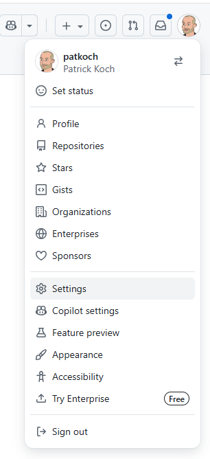
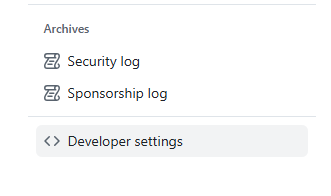
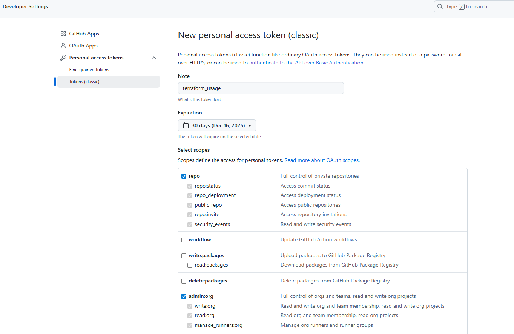

# examples\repository

This Terraform example automates creation and basic configuration of a GitHub repository using the Terraform GitHub provider. It defines the repository resource, exposes inputs for name/description/visibility and repo features (issues, wiki, projects), and uses a provider configuration that reads an authentication token from the environment so infrastructure can be applied non-interactively.

 * Goal: Create a GitHub repository (github_repository.repo) with configurable metadata and initialization options.
 * Provider & Auth: Uses the github provider; authentication is supplied via the TF_VAR_github_token environment variable (so the token is not stored in plaintext). The repo owner is provided via github_owner variable.
 * Inputs: Configurable through variables.tf and terraform.tfvars (examples live in terraform.tfvars), including repository_name, description, visibility, auto_init, has_issues, has_wiki, and has_projects.
 * Files of interest: terraform.tf (required_providers / Terraform version), providers.tf (provider configuration), main.tf (resource declaration), and terraform.tfvars (example values).
 * Typical workflow: set the environment variable, run terraform init, then terraform plan and terraform apply to create the repository.
 * Caveat: Keep only one non-aliased provider and one required_providers block in the module root to avoid duplicate-configuration errors.

# Deploy a new GitHub repository using Terraform

## Prepare the parametrization files

 * Rename "examples/repository/terraform.tfvars.example" to "examples/repository/terraform.tfvars"
 * Set your GitHub owner inb line 2 of the terraform.tfvars file
 * Set the name of the GitHub repository to be created in line 5

## Create a proper Personal Access token

Click on your profile in the right upper corner and choose "Settings"

<p align="left">
  
</p>

Click on "Developer Settings"

<p align="left">
  
</p>

Choose the following scopes for your PAT:

<p align="left">
  
</p>

<p align="left">
  
</p>

Create the PAT and copy the value of it.

## Set the environment variable

Set the value of the previously created value by starting a new bash prompt and set it like:

```bash
export TF_VAR_github_token="your_token_here"
```


## Initialize the working direcotory

```bash
terraform init
```

## Validate it

```bash
terraform validate
```

## Create an execution plan

```bash
terraform plan -out tfplan
```

## Apply using the created plan

```bash
terraform apply tfplan
```
The repository should be created.

# Destroy the GitHub repository

```bash
terraform destroy
```

Verify the logs and confirm it with "yes"